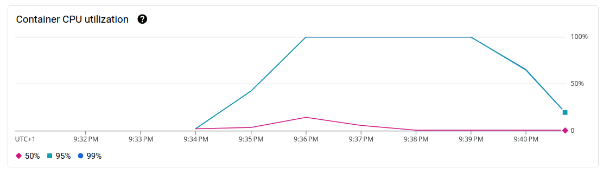

# Performance Testing on GCP

Test des performances entre différents services GCP. L'idée est de voir les différences de performance pour une API
simple entre Cloud Function, Cloud Run (avec différents conteneurs).

Le cas d'usage est une API permettant de convertir du Markdown en HTML.

# Cloud Function

Premier test avec une Cloud Function en PHP.

```php
FunctionsFramework::http('index', 'index');

function index(ServerRequestInterface $request): ResponseInterface
{
    if ('POST' !== $request->getMethod() || empty($body = $request->getBody()->getContents())) {
        return new Response(status: 400);
    }

    $json = json_decode($body, true);
    if (json_last_error() !== JSON_ERROR_NONE) {
        throw new RuntimeException(sprintf('Could not parse body: %s', json_last_error_msg()));
    }

    $html = (new Parsedown())->parse($json['data'] ?? '');

    return new Response(status: 200, body: json_encode(['result' => $html]));
}
```

La CF est simple et l'essentiel de la charge est portée par la
dépendance [Parsedown](https://github.com/erusev/parsedown), ce qui n'est pas un problème pour la comparaison puisque
les autres utilise la même dépendance.

Déploiement de la fonction via gcloud

```shell
gcloud functions deploy mardown-to-html \
    --gen2 \
    --runtime=php82 \
    --region=europe-west1 \
    --source=./cloud-function/ \
    --entry-point=index \
    --trigger-http \
    --allow-unauthenticated
```

Pour le test, j'utilise [hey](https://github.com/rakyll/hey) :

```shell
hey \
    -c 100 \
    -z '1m' \
    -m 'POST' \
    -T 'application/json' \
    -d '{"data": "# h1\n_test_\n__test__\n"}' \
    -h2 \
    https://europe-west1-default-386621.cloudfunctions.net/mardown-to-html
```

> On a 100 processus en continu pendant 1 minute qui vont effectuer la même requête.

<details>
<summary>Résultat du test : <strong>1374 req/sec</strong></summary>

```shell
Summary:
  Total:	60.0715 secs
  Slowest:	1.5860 secs
  Fastest:	0.0342 secs
  Average:	0.0727 secs
  Requests/sec:	1374.1454
  

Response time histogram:
  0.034 [1]	|
  0.189 [81570]	|■■■■■■■■■■■■■■■■■■■■■■■■■■■■■■■■■■■■■■■■
  0.345 [753]	|
  0.500 [52]	|
  0.655 [71]	|
  0.810 [7]	|
  0.965 [81]	|
  1.120 [0]	|
  1.276 [0]	|
  1.431 [0]	|
  1.586 [12]	|


Latency distribution:
  10% in 0.0507 secs
  25% in 0.0601 secs
  50% in 0.0674 secs
  75% in 0.0756 secs
  90% in 0.0880 secs
  95% in 0.1054 secs
  99% in 0.1990 secs

Details (average, fastest, slowest):
  DNS+dialup:	0.0000 secs, 0.0342 secs, 1.5860 secs
  DNS-lookup:	0.0000 secs, 0.0000 secs, 0.0008 secs
  req write:	0.0000 secs, 0.0000 secs, 0.0016 secs
  resp wait:	0.0713 secs, 0.0336 secs, 1.2923 secs
  resp read:	0.0010 secs, 0.0000 secs, 0.4074 secs

Status code distribution:
  [200]	82547 responses
``` 

</details>

# Cloud Run sans concurrence

En réalité Cloud Function en gen2 utilise Cloud Run, on peut d'ailleurs retrouver notre CF _(Cloud Function)_
directement dans le service Cloud Run dans la console GCP.

## Avec une image apache

Voyons voir avec un CR _(Cloud Run)_ utilisant une image `php:8.2-apache` :

J'utilise Symfony dans sa version la plus légère pour mon code même si ça alourdît un peu le runtime.

```shell
gcloud run deploy cr-apache-m2h \
    --region europe-west1 \
    --source=./cloudrun-apache/ \
    --port=80
```

On peut relancer le test

```shell
hey \
    -c 100 \
    -z '1m' \
    -m 'POST' \
    -T 'application/json' \
    -d '{"data": "# h1\n_test_\n__test__\n"}' \
    -h2 \
    https://cr-apache-m2h-4yexhpt4xq-ew.a.run.app/
```

<details>
<summary>Résultat du test : <strong>78 req/sec</strong></summary>

```shell
Summary:
  Total:	61.8220 secs
  Slowest:	11.8256 secs
  Fastest:	0.0664 secs
  Average:	1.2685 secs
  Requests/sec:	77.8364
  

Response time histogram:
  0.066 [1]	|
  1.242 [3205]	|■■■■■■■■■■■■■■■■■■■■■■■■■■■■■■■■■■■■■■■■
  2.418 [864]	|■■■■■■■■■■■
  3.594 [349]	|■■■■
  4.770 [174]	|■■
  5.946 [112]	|■
  7.122 [45]	|■
  8.298 [22]	|
  9.474 [19]	|
  10.650 [13]	|
  11.826 [8]	|


Latency distribution:
  10% in 0.0805 secs
  25% in 0.1902 secs
  50% in 0.6918 secs
  75% in 1.6994 secs
  90% in 3.1040 secs
  95% in 4.6149 secs
  99% in 8.0668 secs

Details (average, fastest, slowest):
  DNS+dialup:	0.0001 secs, 0.0664 secs, 11.8256 secs
  DNS-lookup:	0.0000 secs, 0.0000 secs, 0.0011 secs
  req write:	0.0001 secs, 0.0000 secs, 0.0004 secs
  resp wait:	1.2585 secs, 0.0661 secs, 11.5144 secs
  resp read:	0.0035 secs, 0.0000 secs, 0.1865 secs

Status code distribution:
  [200]	4812 responses
```

</details>

Le résultat est très mauvais, mais en regardant la configuration, on peut vite comprendre pourquoi : Le nombre de
requêtes en concurrence est de **80 par conteneur** avec 1 CPU et 512Mo de RAM alloué par conteneur.

On peut changer pour avoir une configuration proche de celle des CF : 1 requête concurrente, 167 milli CPU
et 256Mo de RAM.


<details>
<summary>Résultat du 2ᵉ test : <strong>479 req/sec</strong></summary>

```shell
Summary:
  Total:	61.8299 secs
  Slowest:	2.1449 secs
  Fastest:	0.0639 secs
  Average:	0.2033 secs
  Requests/sec:	479.2176
  

Response time histogram:
  0.064 [1]	|
  0.272 [19982]	|■■■■■■■■■■■■■■■■■■■■■■■■■■■■■■■■■■■■■■■■
  0.480 [8168]	|■■■■■■■■■■■■■■■■
  0.688 [1178]	|■■
  0.896 [146]	|
  1.104 [33]	|
  1.312 [17]	|
  1.521 [2]	|
  1.729 [65]	|
  1.937 [21]	|
  2.145 [17]	|


Latency distribution:
  10% in 0.0741 secs
  25% in 0.0821 secs
  50% in 0.1039 secs
  75% in 0.3160 secs
  90% in 0.4160 secs
  95% in 0.4800 secs
  99% in 0.6932 secs

Details (average, fastest, slowest):
  DNS+dialup:	0.0000 secs, 0.0639 secs, 2.1449 secs
  DNS-lookup:	0.0000 secs, 0.0000 secs, 0.0021 secs
  req write:	0.0000 secs, 0.0000 secs, 0.0011 secs
  resp wait:	0.2001 secs, 0.0638 secs, 1.9544 secs
  resp read:	0.0021 secs, 0.0000 secs, 0.1075 secs

Status code distribution:
  [200]	29630 responses
```

</details>

On est un peu mieux, mais on est toujours loin des performances de la CF.

Dans un benchmark récent de différents runtimes PHP, disponible
sur [Medium](https://medium.com/@dimdev/9-php-runtimes-performance-benchmark-cbc0527b9df9), on peut retrouver des
indications similaires au test que je viens d'effectuer environ 400 req/sec. C'est surement une coincidence, mais si
j'en crois les résultats, on devrait essayer avec FrankenPHP.

> Le benchmark semble être réalisé avec un conteneur en local et non pas dans un environnement Cloud, ce qui, forcément,
> change totalement le résultat. Dans mon cas, il est important de voir le temps de démarrage d'un conteneur par
> exemple.

## Avec une image FrankenPHP

Le code est identique à la version apache, mais on va changer le runtime Symfony pour utiliser celui de FrankenPHP en
mode Worker. Le Dockerfile est construit par rapport aux informations données dans la documentation
de [FrankenPHP](https://frankenphp.dev/docs/).

```shell
gcloud run deploy cr-frankenphp-m2h \
    --region europe-west1 \
    --source=./cloudrun-frankenphp/ \
    --port=80 \
    --concurrency=1 \
    --cpu=0.167 \
    --memory=256Mi
```

```shell
hey \
    -c 100 \
    -z '1m' \
    -m 'POST' \
    -T 'application/json' \
    -d '{"data": "# h1\n_test_\n__test__\n"}' \
    -h2 \
    https://cr-frankenphp-m2h-4yexhpt4xq-ew.a.run.app/
```

<details>
<summary>Résultat du test : <strong>1646 req/sec</strong></summary>

```shell
Summary:
  Total:	60.0589 secs
  Slowest:	2.7597 secs
  Fastest:	0.0313 secs
  Average:	0.0607 secs
  Requests/sec:	1645.8348
  
  Total data:	15123591 bytes
  Size/request:	153 bytes

Response time histogram:
  0.031 [1]	|
  0.304 [98634]	|■■■■■■■■■■■■■■■■■■■■■■■■■■■■■■■■■■■■■■■■
  0.577 [27]	|
  0.850 [17]	|
  1.123 [19]	|
  1.396 [54]	|
  1.668 [19]	|
  1.941 [2]	|
  2.214 [43]	|
  2.487 [20]	|
  2.760 [11]	|


Latency distribution:
  10% in 0.0413 secs
  25% in 0.0457 secs
  50% in 0.0541 secs
  75% in 0.0649 secs
  90% in 0.0778 secs
  95% in 0.0920 secs
  99% in 0.1207 secs

Details (average, fastest, slowest):
  DNS+dialup:	0.0000 secs, 0.0313 secs, 2.7597 secs
  DNS-lookup:	0.0000 secs, 0.0000 secs, 0.0011 secs
  req write:	0.0000 secs, 0.0000 secs, 0.0025 secs
  resp wait:	0.0599 secs, 0.0312 secs, 2.4421 secs
  resp read:	0.0004 secs, 0.0000 secs, 0.2419 secs

Status code distribution:
  [200]	98847 responses
```

</details>

C'est un peu mieux que la CF, on a gagné 300 requêtes par seconde avec une infra identique.

> On peut surement améliorer légèrement les résultats en modifiant un peu les paramètres des conteneurs : augmenter le
> CPU, mettre 2 processus en concurrence sur un même conteneur, ect.

Autre possibilité de FrankenPHP, créer directement un binaire avec son application PHP.

## Binaire FrankenPHP

Comme le présente Kévin Dunglas dans son dernier
Post : [PHP and Symfony Apps As Standalone Binaries](https://dunglas.dev/2023/12/php-and-symfony-apps-as-standalone-binaries/),
il est désormais possible de construire un binaire depuis son application Symfony.

Pour faire ça on va copier le code de notre version FrankenPHP et construire le binaire en
suivante [la documentation](https://frankenphp.dev/docs/embed/) :

```shell
cp -r cloudrun-frankenphp cloudrun-binary
echo APP_ENV=prod > .env.local
echo APP_DEBUG=0 >> .env.local
composer install --ignore-platform-reqs --no-dev -a
composer dump-env prod

docker build -t static-app -f static-build.Dockerfile .
docker cp $(docker create --name static-app-tmp static-app):/go/src/app/dist/frankenphp-linux-x86_64 my-app ; docker rm static-app-tmp
```

On peut construire un Dockerfile avec uniquement notre binaire :

```dockerfile
FROM alpine:latest

WORKDIR /srv

EXPOSE 80

COPY ./my-app .

ENTRYPOINT ./my-app php-server
```

On le déploie sur Cloud Run comme pour les autres versions :

```shell
gcloud run deploy cr-binary-m2h \
    --region europe-west1 \
    --source=./cloudrun-binary/ \
    --port=80 \
    --concurrency=1 \
    --cpu=0.167 \
    --memory=256Mi
```

Lancement des tests :

```shell
hey \
    -c 100 \
    -z '1m' \
    -m 'POST' \
    -T 'application/json' \
    -d '{"data": "# h1\n_test_\n__test__\n"}' \
    -h2 \
    https://cr-binary-m2h-4yexhpt4xq-ew.a.run.app/
```

<details>
<summary>Résultat du test : <strong>1126 req/sec</strong></summary>

```shell
Summary:
  Total:	60.2251 secs
  Slowest:	7.2720 secs
  Fastest:	0.0350 secs
  Average:	0.0886 secs
  Requests/sec:	1125.7259
  
  Total data:	10372941 bytes
  Size/request:	153 bytes

Response time histogram:
  0.035 [1]	|
  0.759 [67538]	|■■■■■■■■■■■■■■■■■■■■■■■■■■■■■■■■■■■■■■■■
  1.482 [94]	|
  2.206 [96]	|
  2.930 [8]	|
  3.653 [2]	|
  4.377 [40]	|
  5.101 [2]	|
  5.825 [3]	|
  6.548 [1]	|
  7.272 [12]	|


Latency distribution:
  10% in 0.0463 secs
  25% in 0.0535 secs
  50% in 0.0650 secs
  75% in 0.1020 secs
  90% in 0.1292 secs
  95% in 0.1429 secs
  99% in 0.2575 secs

Details (average, fastest, slowest):
  DNS+dialup:	0.0000 secs, 0.0350 secs, 7.2720 secs
  DNS-lookup:	0.0000 secs, 0.0000 secs, 0.0010 secs
  req write:	0.0000 secs, 0.0000 secs, 0.0006 secs
  resp wait:	0.0877 secs, 0.0349 secs, 6.9755 secs
  resp read:	0.0004 secs, 0.0000 secs, 0.0807 secs

Status code distribution:
  [200]	67797 responses
```

</details>

On est moins performant que sur la version précédente, peut-être parce qu'il manque le mode worker.
Pour activer le mode worker, je rajoute un entrypoint dans lequel je vais lancer ma commande :

```shell
#!/bin/sh

APP_RUNTIME=Runtime\\FrankenPhpSymfony\\Runtime ./my-app php-server --worker public/index.php
```

<details>
<summary>Résultat du test en mode worker : <strong>1338 req/sec</strong></summary>

```shell
Summary:
  Total:	60.0486 secs
  Slowest:	7.4946 secs
  Fastest:	0.0320 secs
  Average:	0.0747 secs
  Requests/sec:	1337.8986
  
  Total data:	12291867 bytes
  Size/request:	153 bytes

Response time histogram:
  0.032 [1]	|
  0.778 [80178]	|■■■■■■■■■■■■■■■■■■■■■■■■■■■■■■■■■■■■■■■■
  1.525 [43]	|
  2.271 [26]	|
  3.017 [82]	|
  3.763 [0]	|
  4.510 [1]	|
  5.256 [1]	|
  6.002 [0]	|
  6.748 [3]	|
  7.495 [4]	|


Latency distribution:
  10% in 0.0505 secs
  25% in 0.0572 secs
  50% in 0.0651 secs
  75% in 0.0765 secs
  90% in 0.0944 secs
  95% in 0.1079 secs
  99% in 0.1530 secs

Details (average, fastest, slowest):
  DNS+dialup:	0.0000 secs, 0.0320 secs, 7.4946 secs
  DNS-lookup:	0.0000 secs, 0.0000 secs, 0.0013 secs
  req write:	0.0000 secs, 0.0000 secs, 0.0034 secs
  resp wait:	0.0737 secs, 0.0319 secs, 7.1737 secs
  resp read:	0.0005 secs, 0.0000 secs, 0.0341 secs

Status code distribution:
  [200]	80339 responses
```

</details>

> J'ai peut-être loupé quelque chose d'important dans cette version, je m'attendais à quelque chose de plus performant
> que la version précédente.

> À noter qu'en doublant la valeur de CPU et de la RAM, on obtient un résultat quasi identique.

## Et ça donne quoi une CF avec Go ?

Je fais une partie hors sujet, mais je voudrais comparer les performances de notre API en PHP versus une version en Go.
Pour ça je passe par une CF parce que, étant novice en Go, je n'ai pas envie de m'embêter.

```shell
gcloud functions deploy markdown-to-html-go \
    --gen2 \
    --runtime=go121 \
    --region=europe-west1 \
    --source=./go-function/ \
    --entry-point=main \
    --trigger-http \
    --allow-unauthenticated
```

```shell
hey \
    -c 100 \
    -z '1m' \
    -m 'POST' \
    -T 'application/json' \
    -d '{"data": "# h1\n_test_\n__test__\n"}' \
    -h2 \
    https://europe-west1-default-386621.cloudfunctions.net/markdown-to-html-go
```

<details>
<summary>Résultat du test : 1488 req/sec</summary>

```shell
Summary:
  Total:	60.0850 secs
  Slowest:	0.7013 secs
  Fastest:	0.0314 secs
  Average:	0.0671 secs
  Requests/sec:	1488.3242
  
  Total data:	14576438 bytes
  Size/request:	163 bytes

Response time histogram:
  0.031 [1]	|
  0.098 [87746]	|■■■■■■■■■■■■■■■■■■■■■■■■■■■■■■■■■■■■■■■■
  0.165 [1505]	|■
  0.232 [17]	|
  0.299 [13]	|
  0.366 [28]	|
  0.433 [31]	|
  0.500 [5]	|
  0.567 [23]	|
  0.634 [41]	|
  0.701 [16]	|


Latency distribution:
  10% in 0.0479 secs
  25% in 0.0588 secs
  50% in 0.0669 secs
  75% in 0.0736 secs
  90% in 0.0812 secs
  95% in 0.0878 secs
  99% in 0.1074 secs

Details (average, fastest, slowest):
  DNS+dialup:	0.0000 secs, 0.0314 secs, 0.7013 secs
  DNS-lookup:	0.0000 secs, 0.0000 secs, 0.0009 secs
  req write:	0.0000 secs, 0.0000 secs, 0.0019 secs
  resp wait:	0.0664 secs, 0.0309 secs, 0.5827 secs
  resp read:	0.0005 secs, 0.0000 secs, 0.0434 secs

Status code distribution:
  [200]	89426 responses
```

</details>

Au final notre PHP avec Symfony n'est pas ridicule. 😉

## CloudRun avec de la concurrence

### FrankenPHP

```shell
gcloud run deploy cr-frankenphp-concu-m2h \
    --region europe-west1 \
    --source=./cloudrun-frankenphp/ \
    --port=80 \
    --concurrency=10 \
    --cpu=1 \
    --memory=512Mi \
    --env-vars-file=./cloudrun-frankenphp/concurrency.yaml
```

```shell
hey \
    -c 100 \
    -z '1m' \
    -m 'POST' \
    -T 'application/json' \
    -d '{"data": "# h1\n_test_\n__test__\n"}' \
    -h2 \
    https://cr-frankenphp-concu-m2h-4yexhpt4xq-ew.a.run.app
```

<details>
<summary>Résultat du test : <strong>1255.6 req/sec</strong></summary>

```shell
Summary:
  Total:	60.0724 secs
  Slowest:	2.2307 secs
  Fastest:	0.0441 secs
  Average:	0.0796 secs
  Requests/sec:	1255.6675
  
  Total data:	11540943 bytes
  Size/request:	153 bytes

Response time histogram:
  0.044 [1]	|
  0.263 [75305]	|■■■■■■■■■■■■■■■■■■■■■■■■■■■■■■■■■■■■■■■■
  0.481 [60]	|
  0.700 [10]	|
  0.919 [0]	|
  1.137 [0]	|
  1.356 [0]	|
  1.575 [0]	|
  1.793 [15]	|
  2.012 [2]	|
  2.231 [38]	|


Latency distribution:
  10% in 0.0656 secs
  25% in 0.0699 secs
  50% in 0.0762 secs
  75% in 0.0839 secs
  90% in 0.0934 secs
  95% in 0.1016 secs
  99% in 0.1238 secs

Details (average, fastest, slowest):
  DNS+dialup:	0.0000 secs, 0.0441 secs, 2.2307 secs
  DNS-lookup:	0.0000 secs, 0.0000 secs, 0.0014 secs
  req write:	0.0001 secs, 0.0000 secs, 0.0031 secs
  resp wait:	0.0790 secs, 0.0439 secs, 2.0954 secs
  resp read:	0.0004 secs, 0.0000 secs, 0.0369 secs

Status code distribution:
  [200]	75431 responses
```

</details>

Le choix de 10 processus par conteneur est assez arbitraire, mais en fonction de l'application, il faut faire pas mal de
fine tuning là-dessus entre RAM, CPU et concurrence.

Dans mon cas, j'ai un problème de CPU avec 10 requêtes en concurrence :



Deuxième test avec 5 requêtes par exemple.

<details>
<summary>Résultat du test : <strong>1414 req/sec</strong></summary>

```shell
Summary:
  Total:	60.0668 secs
  Slowest:	6.6313 secs
  Fastest:	0.0414 secs
  Average:	0.0707 secs
  Requests/sec:	1414.4427
  
  Total data:	12999033 bytes
  Size/request:	153 bytes

Response time histogram:
  0.041 [1]	|
  0.700 [84895]	|■■■■■■■■■■■■■■■■■■■■■■■■■■■■■■■■■■■■■■■■
  1.359 [19]	|
  2.018 [45]	|
  2.677 [0]	|
  3.336 [0]	|
  3.995 [0]	|
  4.654 [0]	|
  5.313 [0]	|
  5.972 [0]	|
  6.631 [1]	|


Latency distribution:
  10% in 0.0592 secs
  25% in 0.0620 secs
  50% in 0.0669 secs
  75% in 0.0729 secs
  90% in 0.0803 secs
  95% in 0.0877 secs
  99% in 0.1198 secs

Details (average, fastest, slowest):
  DNS+dialup:	0.0000 secs, 0.0414 secs, 6.6313 secs
  DNS-lookup:	0.0000 secs, 0.0000 secs, 0.0029 secs
  req write:	0.0000 secs, 0.0000 secs, 0.0013 secs
  resp wait:	0.0701 secs, 0.0411 secs, 6.6312 secs
  resp read:	0.0003 secs, 0.0000 secs, 0.0481 secs

Status code distribution:
  [200]	84961 responses
```

</details>

Et voici l'usage CPU qui va avec :


Ça ne semble pas améliorer les performances, mais pas non plus les réduire.
En fonction des applications le fine tuning est intéressant à faire que ce soit avec ou sans concurrence.

## Nginx + PHP-FPM

Surement le combo le plus utilisé pour du PHP en prod voyons voir ce que cela donne sur Cloud Run...

Le conteneur utilise l'image `php:8.2-fpm-alpine-3.18` sur laquelle on vient rajouter nginx et supervisor.
Supervisor s'occupe de manager les processus master php-fpm et nginx qui ont chacun un pool de workers.

```shell
gcloud run deploy cr-nginx-fpm-m2h \
    --region europe-west1 \
    --source=./cloudrun-nginx-fpm/ \
    --port=80 \
    --concurrency=10 \
    --cpu=1 \
    --memory=512Mi
```

### En pool dynamique

Dans cette première version le pool de processus php-fpm est dynamic avec la configuration suivante :

```
pm = dynamic
pm.max_children = 25
pm.max_requests = 500
pm.max_spare_servers = 4
pm.min_spare_servers = 2
pm.start_servers = 4
```

> Notre pool de processus est dynamique, il démarre avec 4 processus et prend entre 2 et 4 processus en attente. Et on
> va pouvoir monter jusqu'à un maximum de 25 processus.

```shell
hey \
    -c 100 \
    -z '1m' \
    -m 'POST' \
    -T 'application/json' \
    -d '{"data": "# h1\n_test_\n__test__\n"}' \
    -h2 \
    https://cr-nginx-fpm-m2h-4yexhpt4xq-ew.a.run.app
```

<details>
<summary>Résultat du test : <strong>1225 req/sec</strong></summary>

```shell
Summary:
  Total:	60.0753 secs
  Slowest:	2.7171 secs
  Fastest:	0.0411 secs
  Average:	0.0816 secs
  Requests/sec:	1225.2956
  
  Total data:	48000 bytes
  Size/request:	0 bytes

Response time histogram:
  0.041 [1]	|
  0.309 [73159]	|■■■■■■■■■■■■■■■■■■■■■■■■■■■■■■■■■■■■■■■■
  0.576 [295]	|
  0.844 [3]	|
  1.111 [3]	|
  1.379 [9]	|
  1.647 [10]	|
  1.914 [34]	|
  2.182 [27]	|
  2.450 [7]	|
  2.717 [62]	|


Latency distribution:
  10% in 0.0600 secs
  25% in 0.0655 secs
  50% in 0.0719 secs
  75% in 0.0805 secs
  90% in 0.0946 secs
  95% in 0.1087 secs
  99% in 0.2149 secs

Details (average, fastest, slowest):
  DNS+dialup:	0.0000 secs, 0.0411 secs, 2.7171 secs
  DNS-lookup:	0.0000 secs, 0.0000 secs, 0.0009 secs
  req write:	0.0001 secs, 0.0000 secs, 0.0024 secs
  resp wait:	0.0804 secs, 0.0406 secs, 2.6163 secs
  resp read:	0.0009 secs, 0.0000 secs, 0.1311 secs

Status code distribution:
  [200]	73290 responses
  [502]	320 responses
```

</details>

À la différence des autres conteneurs, on retrouve ici **plusieurs réponses en 502 (Bad Gateway)** qui sont renvoyées
par
nginx. Car Nginx n'a pas réussi à contacter php-fpm qui était surement
incapable de répondre au gros volume de requêtes entrantes.

> **Fait étonnant** : changer le nombre de requêtes concurrentes n'a pas de gros impacts sur le nombre de 502.

### En pool statique

Deuxième test cette fois-ci avec un pool php-fpm statique :

```
pm = static
pm.max_children = 20
pm.max_requests = 500
```

> Voici un article qui parle de l'optimisation php-fpm avec nginx sur
> CloudRun : https://xebia.com/blog/optimizing-php-performance-google-cloudrun/

<details>
<summary>Résultat du test : <strong>1225 req/sec</strong></summary>

```shell
Summary:
  Total:	60.1409 secs
  Slowest:	3.1275 secs
  Fastest:	0.0446 secs
  Average:	0.1229 secs
  Requests/sec:	812.6581
  
  Total data:	29850 bytes
  Size/request:	0 bytes

Response time histogram:
  0.045 [1]	|
  0.353 [47967]	|■■■■■■■■■■■■■■■■■■■■■■■■■■■■■■■■■■■■■■■■
  0.661 [517]	|
  0.970 [185]	|
  1.278 [84]	|
  1.586 [55]	|
  1.894 [8]	|
  2.203 [6]	|
  2.511 [10]	|
  2.819 [3]	|
  3.128 [38]	|


Latency distribution:
  10% in 0.0740 secs
  25% in 0.0864 secs
  50% in 0.1019 secs
  75% in 0.1241 secs
  90% in 0.1618 secs
  95% in 0.1997 secs
  99% in 0.5737 secs

Details (average, fastest, slowest):
  DNS+dialup:	0.0000 secs, 0.0446 secs, 3.1275 secs
  DNS-lookup:	0.0000 secs, 0.0000 secs, 0.0010 secs
  req write:	0.0001 secs, 0.0000 secs, 0.0025 secs
  resp wait:	0.1218 secs, 0.0445 secs, 3.0093 secs
  resp read:	0.0007 secs, 0.0000 secs, 0.0491 secs

Status code distribution:
  [200]	48675 responses
  [502]	199 responses
```

</details>
